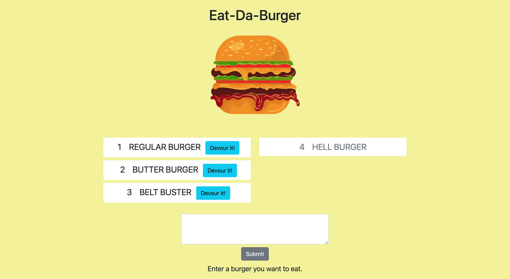

# burger

## Description
 

Eat-Da-Burger is a restaurant application where you can enter the name of the burger you would like to eat, click "devour it" and it will appear in the devour section of the page. The application uses Node.js, Handlebars.js and Mysql in the back end to store data and deliver it to the client side.

## Usage
Visit the link [here](https://trevor-smith-burger.herokuapp.com/) to use the application.

